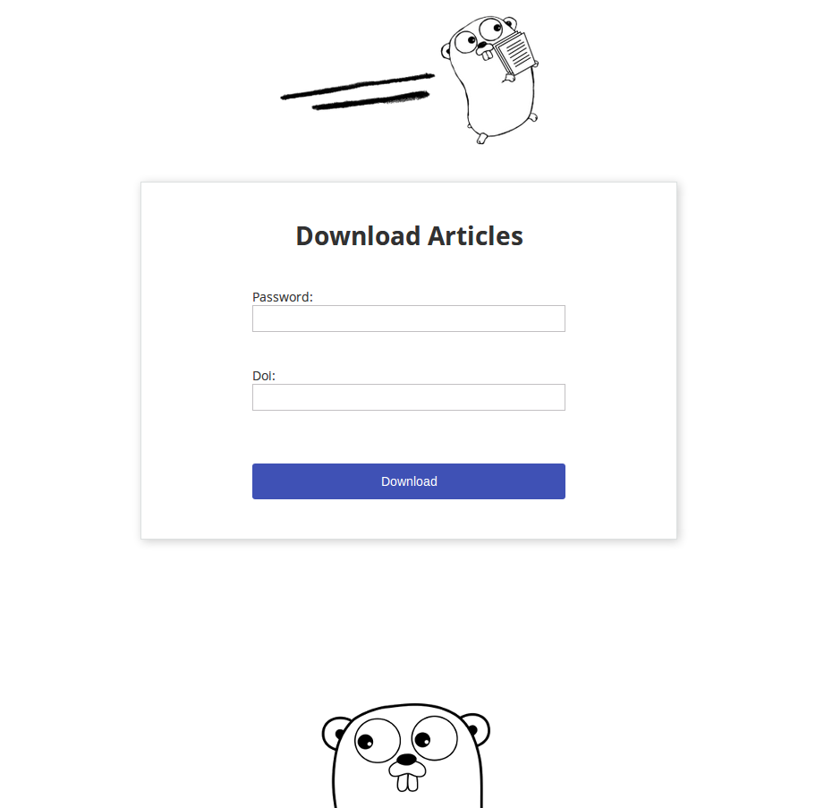

# GoScience
GoScience is proxy server written in Go for downloading academic papers from Scihub, particulary
useful in case your institution/workplace blocked the access to Scihub, but you
still need the access to scientific articles.

GoScience is very easy to use. All you need is password, and doi link. See screenshot of
application below:



Doi could be provided via url:
```
http://dx.doi.org/10.1145/2854146
```

or just the number
```
10.1145/2854146
```

# GoScience Configuration
GoScience server port and password used for downloading articles are set via `conf.json` file
located in the GoScience root directory. Password is used to keep the bots and undesirable
people away from spending our precious bandwith.

Configuration example:

```json
{
    "PORT": "8080",
    "PASSWORD": "super_secret_password"
}
```

## Starting server
Server is started via executing main binary file:
```
./main
```